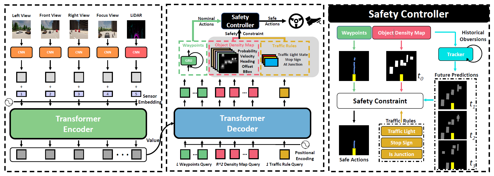

# End-to-end Autonomous Driving Agents

## Interfuser

1. Sensors

- rgb front: 800x600
- rgb left: 400x300
- rgb right: 400x300
- lidar
- imu
- gnss

2. Inputs
- rgb front
- rgb focus -> cropped from the center of rgb front camera
- rgb left
- rgb right
- lidar
- measurements -> (velocity, next_command). `next_command` is the road option of following lane, left, right, change to left lane, change to right lane, etc..
- target point -> from route planner. waypoint xx meters ahead?

3. Outputs
- traffic: object density map
- predicted waypoints: 10 waypoints
- is at junction
- traffic light state
- stop sign
- bev feature

4. Training Loss

The loss function considers three losses:
- waypoint prediction loss using L1 norm
- object density map loss
    - object density map is a RXRX7: 1 is probability of occupancy, the other 6 channels are x, y, heading, v, and bb_x, bb_y
- traffic info loss
    - traffic light status, stop sign, at junction